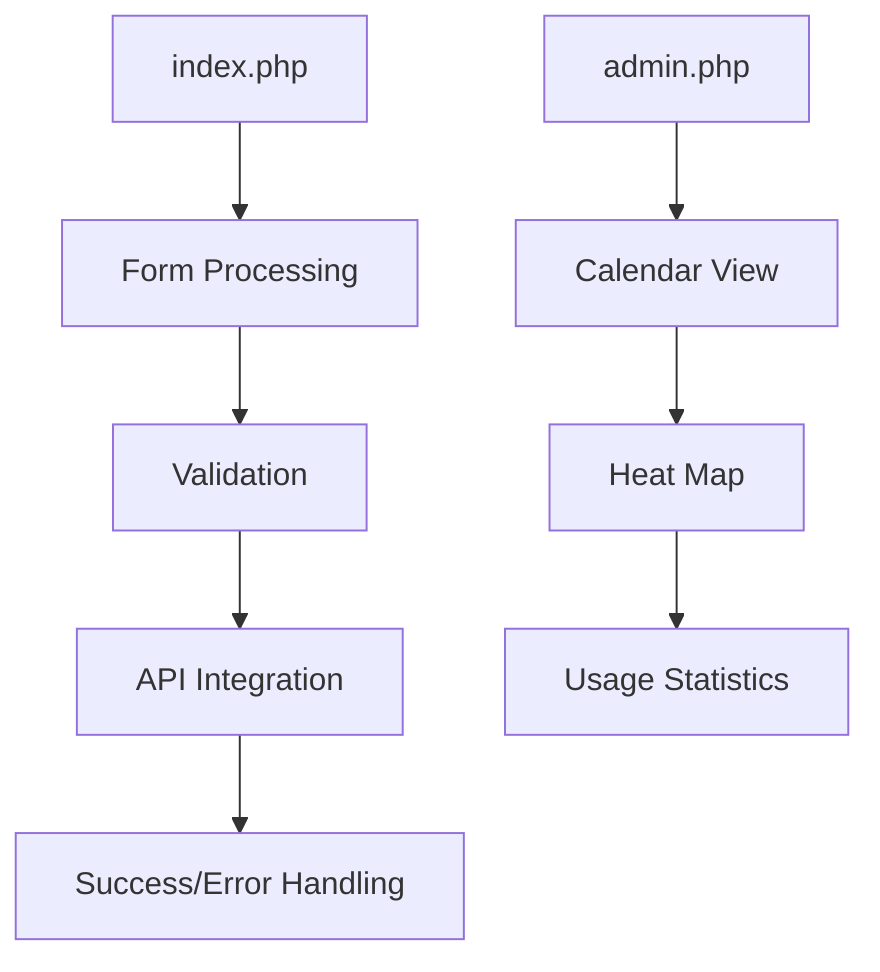
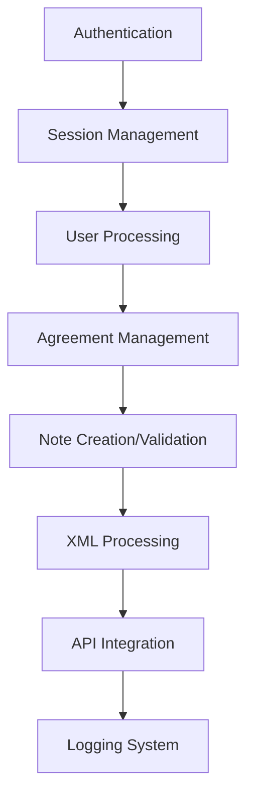

# System Patterns

## Architecture Overview

### Core Components
1. Authentication Layer
   - Session-based authentication
   - Role-based access control
   - Secure cookie management
   - Login state verification

2. Form Processing Layer
   - Purdue ID collection
   - Input validation
   - Form submission handling
   - Error management

3. Agreement Management Layer
   - Note creation script (fix_agreements.py)
   - Note validation script (validate_note_segments.py)
   - User data handling
   - XML processing

4. Logging Infrastructure
   - Custom Logger class
   - Multiple log paths
   - Fallback mechanisms
   - Debug mode support
   - Timezone-aware logging

5. Administrative Interface
   - Calendar visualization
   - Usage statistics
   - Heat map rendering
   - Data aggregation

## System Integrations

### Alma API Integration
```python
def process_users(config, users, dry_run=False):
    """Process users and manage their agreement notes."""
    session = requests.Session()
    
    for user_id in users:
        # GET user data
        get_url = f"{config['base_url']}{user_id}?view=full&expand=none&apikey={config['api_key']}"
        response = session.get(get_url)
        
        if response.status_code == 200:
            # Process user XML
            process_user_data(response.text)
            
            # PUT updated user data
            put_url = f"{config['base_url']}{user_id}?generate_password=false&..."
            put_response = session.put(put_url, data=modified_xml)
```

### XML Processing Pattern
```python
def check_user_agreement(user_xml):
    """Check user agreement note status."""
    root = ET.fromstring(user_xml)
    notes = root.findall(".//user_note")
    for note in notes:
        note_text = note.find("note_text")
        if "Agreed to Knowledge Lab User Agreement" in note_text.text:
            return True, note.get("segment_type")
    return False, None

def fix_note_segment(user_xml):
    """Update note segment to Internal."""
    root = ET.fromstring(user_xml)
    notes = root.findall(".//user_note")
    for note in notes:
        if "Agreed to Knowledge Lab User Agreement" in note.find("note_text").text:
            note.set("segment_type", "Internal")
            return ET.tostring(root, encoding='unicode')
```

## Note Management Patterns

### Note Structure Pattern
```xml
<user_note>
    <segment_type>Internal</segment_type>
    <note_type>CIRCULATION</note_type>
    <note_text>Agreed to Knowledge Lab User Agreement</note_text>
    <user_viewable>true</user_viewable>
    <popup_note>true</popup_note>
</user_note>
```

### Script Execution Pattern
```python
class ValidationScript:
    def __init__(self):
        self.config = self.load_config()
        self.users = self.get_users()
    
    def run(self, dry_run=False):
        """Execute with optional dry run."""
        print("Starting validation...")
        if dry_run:
            print("DRY RUN MODE - No changes will be made")
        
        results = self.process_users(dry_run)
        self.print_summary(results)
```

## Technical Decisions

### Authentication Strategy
1. Session-Based Authentication
   - Reasons:
     - Simple implementation
     - Built-in PHP support
     - Stateful user tracking
     - Easy role management

2. Cookie Security
   - Secure flag enabled
   - HTTP-only cookies
   - SameSite=Strict policy
   - Configurable lifetime

### Note Management Strategy
1. Separation of Scripts
   - Reasons:
     - Clean separation of concerns
     - Focused functionality
     - Easier maintenance
     - Better error handling

2. XML Processing
   - ElementTree for parsing
   - XPath for navigation
   - String encoding for output
   - Error handling included

### Error Handling Strategy
1. Hierarchical Approach
   - System-level errors
   - Application errors
   - User input errors
   - API communication errors

2. Error Response Pattern
   - Clear user messages
   - Detailed logging
   - Fallback handling
   - Debug information

## Component Relationships

### Frontend Components


### Backend Components


## Implementation Guidelines

### Security Implementation
1. Authentication
   - Verify session on every request
   - Implement role checks
   - Sanitize user input
   - Validate API responses

2. Data Protection
   - Secure configuration
   - Protected API keys
   - Encrypted communication
   - Safe data handling

### Agreement Management Implementation
1. Note Creation
   - Validate user data
   - Check existing notes
   - Structure new notes
   - Verify updates

2. Note Validation
   - Check segment type
   - Verify note content
   - Update if needed
   - Track changes

### Logging Implementation
1. System Logs
   - Use Logger class
   - Include context
   - Handle timezone
   - Manage rotation

2. Debug Information
   - Configurable debug mode
   - Detailed error tracking
   - Performance monitoring
   - Access logging

### API Integration
1. Alma API
   - RESTful communication
   - Error handling
   - Response validation
   - Status tracking

2. Rate Limiting
   - Delay between requests
   - Error backoff
   - Request queuing
   - Status monitoring

## Future Considerations

### Scalability
- Database integration
- Enhanced caching
- Load balancing
- Performance optimization

### Security Enhancements
- Environment variables
- CSRF protection
- XSS prevention
- Input sanitization

### Monitoring
- System health checks
- Performance metrics
- Error tracking
- Usage statistics
